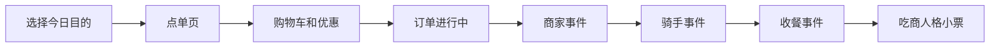

# EATI 面试讲解指南

这份文档帮助你把 EATI 讲成一个 AI/前端方向的小项目，而不是只说“我做了一个点外卖页面”。

## 30 秒版本

EATI 是一个把外卖点单做成人格测试的 Web demo。用户先像在真实外卖平台一样点奶茶、咖啡、主食和小吃，再在商家备餐、骑手配送、收餐确认里做选择。系统会根据用户的菜品结构、规格偏好、优惠券行为和配送沟通，生成一张“吃商人格小票”。我负责把普通点单流程抽象成可玩的状态机和本地规则引擎，并完成移动端前端、结果卡导出、音频反馈和 GitHub Pages 部署。

## 2 分钟版本

这个项目来自一个黑客松场景，最初目标是做“今天你吃商几级？”的互动测试。普通人格测试通常只有问答，我希望把用户更熟悉的外卖点单行为变成测试过程。

项目的主流程是：选择今日情绪或目的，进入仿外卖小程序点单页，添加商品、规格、优惠券和套餐，然后下单。下单后不是直接出结果，而是进入订单进行中阶段，用户要在商家、骑手、收餐三个节点中做选择，比如是否加固包装、如何处理缺货、是否催促骑手、收餐后是否先检查。这些选择会影响快乐、健康、安全、完整度等指标。

技术上我用 React、TypeScript 和 Vite 做成纯前端 demo。核心不是简单页面，而是一个规则系统：商品有标签和属性，规格会改变分数，combo 会触发奖励，配送事件会根据本单商品筛选，最后再把这些行为映射到 16 类“吃商人格”。结果页可以导出 PNG，适合扫码体验和社交分享。

这个项目比较适合展示我对产品场景、前端状态管理、交互细节和 AI 方向落地的理解。后续如果继续做，我会把当前可解释规则引擎作为 fallback，再接入 LLM，根据完整订单轨迹生成更个性化的结果文案。

## 可以重点讲的技术点

### 1. 行为数据建模

项目没有把人格测试写成固定问卷，而是把用户行为拆成结构化输入：

- 下单目的：困、馋、emo、加班、约会等。
- 菜品标签：咖啡因、甜、低糖、热食、蛋白、治愈、分享等。
- 规格选择：糖度、冰量、分量、口味、包装、健康备注。
- 优惠行为：满减券、随机膨胀、套餐选择。
- 配送互动：商家、骑手、收餐节点中的选择。

这些输入进入本地规则引擎，最后输出分数、badge、人格轴和结果文案。

### 2. 前端状态流

页面不是单个表单，而是多阶段流程：

可以强调：购物车、优惠券、钱包、订单阶段、结果卡都共用同一份订单状态，但 UI 呈现完全不同，因此需要清楚地划分数据、规则和视图。

### 3. 可解释规则引擎

项目当前没有依赖模型实时生成结果，原因是黑客松演示需要稳定。规则引擎的优势是：

- 可离线运行，部署简单。
- 结果可解释，方便调试。
- 不会因为模型接口失败导致现场 demo 崩掉。
- 后续可以作为 LLM 生成文案的结构化输入和 fallback。

### 4. 移动端体验和部署

项目按手机扫码体验来设计，包括：

- 小程序式点单布局。
- 底部购物车抽屉。
- 可展开优惠券。
- 公网 GitHub Pages 部署。
- 音频资源适配子路径部署。
- 结果卡 PNG 导出。

这个部分适合展示你不仅能写业务逻辑，还能处理真实演示时会遇到的路径、缓存、音频权限、移动端布局等工程问题。

## 面试官可能追问

### 为什么不用后端？

黑客松阶段优先保证体验闭环和演示稳定，所以使用纯前端本地规则。这样可以快速部署到 GitHub Pages，也避免接口和数据库成为现场风险。后续如果产品化，可以把菜单、事件和结果模板迁移到后端或 CMS。

### 这个项目和普通问卷有什么不同？

普通问卷是用户显式回答“我是怎样的人”。EATI 是让用户在自然点单行为中暴露偏好，例如是否低糖、是否凑券、是否加包装、是否催骑手。这个过程更像行为测试，也更有传播感。

### AI 可以怎么接入？

我会保留本地规则引擎产出的结构化结果，例如人格类型、指标、关键选择和订单摘要，再把它作为 prompt 输入给 LLM，生成更像“小红书分享文案”的个性化结果卡。模型失败时仍然使用本地模板。

### 最大的工程难点是什么？

一是状态复杂度：点单、优惠、钱包、配送事件、结果卡都互相影响。二是部署细节：GitHub Pages 子路径会导致静态音频路径失效，需要通过 `import.meta.env.BASE_URL` 统一生成 public asset 地址。三是内容规模：菜单、图片、事件和人格文案都需要能扩展，不能硬写在 UI 里。

## 适合放在简历上的写法

EATI: 基于 React/TypeScript 的互动外卖人格测试 demo。将外卖点单、优惠券、配送沟通和收餐选择建模为行为数据，设计本地规则引擎生成 16 类“吃商人格”和可分享结果小票；实现移动端点单 UI、购物车抽屉、优惠券交互、订单事件状态机、音频反馈、PNG 导出和 GitHub Pages 部署。

## 下一步扩展计划

- 引入 LLM 生成个性化结果文案。
- 增加埋点，分析用户选择路径。
- 将菜单、事件、人格模板配置化。
- 增加分享页和好友互测机制。
- 把静态 demo 包装成微信小程序或 H5 活动页。
